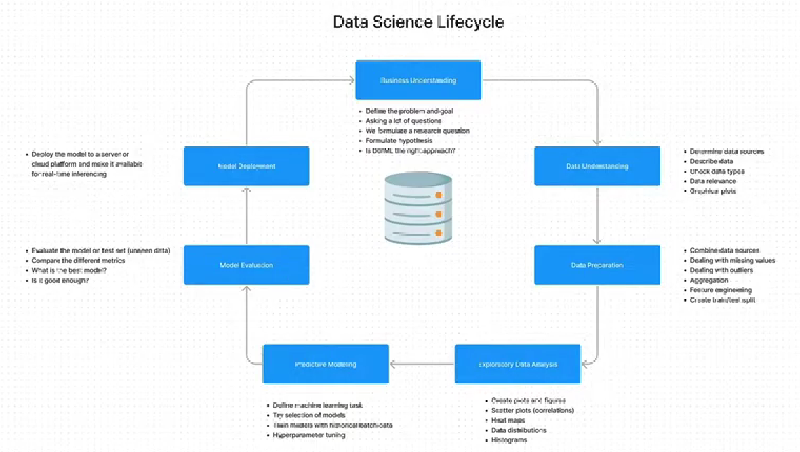

# Handnote — Fitness Tracker with Python

## Part 2: Understanding & Preparing the Raw Sensor Data

> **Mục tiêu của Part 2:** hiểu cấu trúc raw sensor data và chuyển hàng loạt CSV riêng lẻ thành các DataFrame có cấu trúc phù hợp cho **supervised learning**. Nội dung dưới đây bám theo transcript bạn cung cấp. 

---

# 1. Mục tiêu của Part 2

Ở Part 1, ta đã biết:

```text
Accelerometer
+
Gyroscope
        ↓
Sensor data
        ↓
Exercise classification
```

Part 2 bắt đầu đi vào **data preparation**.

Mục tiêu cuối cùng:

```text
Raw CSV files
      ↓
Read data
      ↓
Extract information from filename
      ↓
Add labels
      ↓
Separate accelerometer / gyroscope
      ↓
Combine all files
      ↓
Assign unique set ID
      ↓
Ready for supervised learning
```

---

# 2. Hiểu cấu trúc raw data

Mỗi CSV chứa dữ liệu sensor.

Các thông tin chính gồm:

```text
Timestamp — Epoch
Timestamp — readable format
Elapsed time
X
Y
Z
```

Ví dụ về mặt khái niệm:

| timestamp | elapsed_time |   X |   Y |   Z |
| --------- | -----------: | --: | --: | --: |
| ...       |         0.00 | ... | ... | ... |
| ...       |         0.01 | ... | ... | ... |
| ...       |         0.02 | ... | ... | ... |

Transcript cho biết một recording được minh họa có thời lượng khoảng **12 giây**. 

---

# 3. Accelerometer vs Gyroscope

Có **hai loại file**.

## Accelerometer

Đo acceleration trên:

```text
X-axis
Y-axis
Z-axis
```

Đơn vị được sử dụng trong dataset là **G-force (G)**. 

Concept:

```text
Accelerometer
      ↓
Acceleration
      ↓
X / Y / Z
```

---

## Gyroscope

Đo rotation / angular movement.

Các trục:

```text
X-axis
Y-axis
Z-axis
```

Đơn vị:

```text
degrees / second
```

Transcript giải thích đơn giản:

```text
Accelerometer → acceleration / change in speed
Gyroscope     → rotation
```


---

# 4. Experimental Setup

Dataset có:

```text
5 participants
A
B
C
D
E
```

Mỗi participant thực hiện:

```text
5 exercises
+
Light set
+
Heavy set
```

Sensor được đeo trên wrist. Trong mỗi set, thiết bị ghi đồng thời:

```text
Accelerometer
Gyroscope
```

nhưng dữ liệu được lưu thành **hai file riêng biệt**. 

---

# 5. Một recording được tạo như thế nào?

Ví dụ participant chuẩn bị squat:

```text
Participant
    ↓
Put on sensor
    ↓
Press Record
    ↓
Perform 5 squats
    ↓
Press Stop
    ↓
Export data
```

Kết quả:

```text
1 Accelerometer CSV
+
1 Gyroscope CSV
```


Đây là điểm rất quan trọng vì **một set exercise không phải một CSV duy nhất**.

---

# 6. Tại sao phải hiểu experimental setup?

Vì cách dataset được thu thập quyết định cách chúng ta phải xử lý data.

Nếu không biết:

```text
file nào thuộc participant nào?
file nào là exercise nào?
file nào là accelerometer?
file nào là gyroscope?
file nào thuộc cùng một set?
```

thì rất dễ xử lý sai dataset.

Đây chính là lý do phần **Data Understanding** phải xảy ra trước **Data Preparation**. Transcript liên hệ phần này với Data Science Lifecycle:

```text
Business Understanding
        ↓
Data Understanding
        ↓
Data Preparation
```

Part này đã hoàn thành hai bước đầu và bắt đầu bước Data Preparation. 

---

# 7. Chuyển raw data thành Supervised Learning Dataset

## Supervised Learning

Supervised learning sử dụng:

```text
Input features
+
Target label
```

Ví dụ classification:

```text
Features
   ↓
Model
   ↓
Label
```

Trong project:

```text
Accelerometer X/Y/Z
+
Gyroscope X/Y/Z
        ↓
      Model
        ↓
    Exercise
```

---

# 8. Binary vs Multi-class Classification

Ví dụ binary classification:

```text
Fraud?
 ↓
Yes / No
```

Có 2 labels.

Project này khác:

```text
Exercise
 ↓
Bench Press
Deadlift
Overhead Press
Barbell Row
Squat
Rest
```

Có tổng cộng:

```text
6 classes
```

nên đây là **multi-class classification**. 

---

# 9. Tại sao có "Rest"?

`Rest` cũng là một class.

Trong lúc tập, participant không liên tục thực hiện exercise.

Ví dụ:

```text
Squat
Squat
Squat
   ↓
Rest
   ↓
Walking / Sitting / Waiting
   ↓
Squat
```

Nếu không có `Rest`, model có thể bị buộc phải nhận diện khoảng nghỉ thành một trong các exercise.

Vì vậy:

```text
Exercise classes
+
Rest
```

giúp model phân biệt:

```text
"Đang tập"
vs
"Không tập"
```


---

# 10. Raw Data hiện tại chưa phải ML Dataset

Raw CSV có:

```text
Timestamp
Accelerometer X/Y/Z
Gyroscope X/Y/Z
```

nhưng có **2 vấn đề lớn**.

### Problem 1

Accelerometer và gyroscope nằm trong:

```text
2 separate files
```

Cần kết hợp chúng.

### Problem 2

Label không nằm trong CSV.

Thông tin label nằm trong:

```text
Filename
```

Vì vậy cần extract metadata từ filename. 

---

# 11. Target Dataset

Mục tiêu cuối cùng là tạo DataFrame có dạng:

| timestamp | Acc X | Acc Y | Acc Z | Gyro X | Gyro Y | Gyro Z | label |
| --------- | ----: | ----: | ----: | -----: | -----: | -----: | ----- |
| ...       |   ... |   ... |   ... |    ... |    ... |    ... | squat |
| ...       |   ... |   ... |   ... |    ... |    ... |    ... | squat |
| ...       |   ... |   ... |   ... |    ... |    ... |    ... | rest  |

Transcript mô tả target structure gồm timestamp, XYZ accelerometer, XYZ gyroscope và label. 

---

# 12. Semi-structured Data

Một concept quan trọng:

Raw dataset có một phần metadata nằm **ngoài bảng dữ liệu**.

Ví dụ:

```text
CSV content
    +
Filename
```

Filename chứa:

```text
Participant
Exercise
Set category
Other metadata
```

Vì vậy dataset hiện tại có tính chất **semi-structured**.

Data processing phải:

```text
CSV
+
Filename metadata
        ↓
Final DataFrame
```


---

# 13. Reading a Single CSV

Đầu tiên chưa xử lý 187 file ngay.

Ta thử với **một file** trước.

```python
import pandas as pd

acc_df = pd.read_csv("path/to/file.csv")
```

Sau đó kiểm tra:

```python
acc_df
```

Mục đích:

> xác nhận cách đọc file và hiểu structure trước khi tự động hóa.

Transcript nhấn mạnh cách làm **step-by-step**, xây từng building block trước rồi mới kết hợp chúng. 

---

# 14. Interactive Python trong VS Code

Workflow của project:

```text
Python file
     ↓
Select code
     ↓
Shift + Enter
     ↓
Execute interactively
```

Kết quả xuất hiện ở khu vực interactive bên phải.


### Tư duy quan trọng

Không viết ngay một function khổng lồ.

Thay vào đó:

```text
Read one file
     ↓
Test
     ↓
Extract metadata
     ↓
Test
     ↓
Read all files
     ↓
Test
     ↓
Combine
     ↓
Test
```

Đây là cách dễ debug và hiểu pipeline hơn.

---

# 15. Reading Accelerometer

Ví dụ:

```python
acc_df = pd.read_csv(path)
```

Kết quả là DataFrame chứa accelerometer data.

---

# 16. Reading Gyroscope

Tương tự:

```python
gyro_df = pd.read_csv(path)
```

Điểm khác:

```text
Accelerometer → G-force
Gyroscope     → degrees/second
```

Transcript cũng chỉ ra rằng gyroscope được sampling ở frequency cao hơn, vì vậy số records nhiều hơn dù khoảng thời gian recording tương đương. 

---

# 17. Listing All CSV Files

Sau khi đọc được một file, bước tiếp theo là:

> tìm tất cả CSV files.

Sử dụng thư viện:

```python
import glob
```

Sau đó:

```python
files = glob.glob("../data/raw/metamotion/*.csv")
```

Concept:

```text
Directory
   ↓
glob
   ↓
List of CSV paths
```

Transcript cho biết dataset có tổng cộng:

```text
187 CSV files
```


---

# 18. Glob Pattern

Pattern:

```python
*.csv
```

nghĩa là:

> lấy tất cả file có extension `.csv`.

Ví dụ directory:

```text
data/
├── file1.csv
├── file2.csv
├── file3.csv
├── notes.txt
└── report.pdf
```

```python
glob.glob("*.csv")
```

chỉ lấy:

```text
file1.csv
file2.csv
file3.csv
```

---

# 19. Extract Metadata from Filename

Đây là một phần rất quan trọng của Part 2.

Filename chứa thông tin như:

```text
participant
exercise
set
category
device information
sensor type
frequency
```

Ví dụ transcript minh họa filename chứa:

```text
Participant B
Overhead Press
Heavy set 2
RPE 7
Accelerometer
...
```


Ta cần biến:

```text
Filename
```

thành:

```text
participant
label
category
```

---

# 20. Metadata cần extract

Project extract 3 thông tin chính:

```text
participant
label
category
```

### participant

Ví dụ:

```text
B
```

### label

Ví dụ:

```text
Overhead Press
```

### category

Ví dụ:

```text
heavy
```

hoặc:

```text
light
```


---

# 21. String `.split()`

Một kỹ thuật Python quan trọng:

```python
string.split("-")
```

Nếu filename được phân cách bằng dấu `-`, ta có:

```text
part1-part2-part3
```

→

```python
[
    "part1",
    "part2",
    "part3"
]
```

Sau đó lấy element bằng index:

```python
parts[0]
parts[1]
parts[2]
```

---

# 22. Python Indexing

Nhớ:

```text
Index 0 → element 1
Index 1 → element 2
Index 2 → element 3
```

Ví dụ:

```python
parts = ["B", "overhead press", "heavy2"]

parts[0]
# B

parts[1]
# overhead press

parts[2]
# heavy2
```

---

# 23. `.replace()`

Để loại bỏ một phần string:

```python
string.replace(old, new)
```

Ví dụ:

```python
path.replace(data_path, "")
```

Nếu:

```text
old = "/project/data/"
new = ""
```

thì phần path sẽ bị loại bỏ.

Điểm quan trọng từ transcript:

> `.replace()` sử dụng **exact string match**, không phải partial match. 

---

# 24. `.rstrip()`

`rstrip()` loại bỏ các ký tự được chỉ định từ **bên phải** string.

Ví dụ:

```python
category = "heavy2"

category.rstrip("123")
```

→

```text
heavy
```

Điều này tiện hơn việc viết:

```python
replace("1", "")
replace("2", "")
replace("3", "")
```

vì set có thể là:

```text
1
2
3
```

Transcript sử dụng chính cách này để lấy:

```text
heavy
```

thay vì:

```text
heavy1
heavy2
heavy3
```


---

# 25. Add Metadata vào DataFrame

Sau khi extract:

```python
participant
label
category
```

ta thêm chúng vào DataFrame.

Syntax:

```python
df["participant"] = participant
df["label"] = label
df["category"] = category
```

Kết quả:

```text
timestamp
acc_x
acc_y
acc_z
participant
label
category
```


---

# 26. Tại sao một giá trị có thể được gán cho toàn bộ column?

Ví dụ:

```python
df["participant"] = "B"
```

Nếu DataFrame có 100 rows:

```text
row 1 → B
row 2 → B
row 3 → B
...
row 100 → B
```

Điều này hợp lý vì toàn bộ rows trong file đều thuộc cùng participant.

Tương tự:

```python
df["label"] = "overhead_press"
df["category"] = "heavy"
```

---

# 27. Từ One File → All Files

Sau khi test thành công với một file:

```text
One CSV
   ↓
Extract metadata
   ↓
Add metadata
```

ta chuyển sang:

```text
187 CSV files
      ↓
     Loop
      ↓
Read each file
      ↓
Extract metadata
      ↓
Add metadata
      ↓
Combine
```

---

# 28. Vì sao dùng Loop?

Về nguyên tắc, khi xử lý data bằng Python, nên tránh loop nếu có thể vì loop có thể chậm.

Nhưng trong trường hợp này cần xử lý **từng filename** để extract metadata.

Do đó loop là cách được sử dụng trong project. 

---

# 29. Empty DataFrames

Trước khi loop:

```python
acc_df = pd.DataFrame()
gyro_df = pd.DataFrame()
```

Hai DataFrame ban đầu rỗng.

```text
acc_df  → empty
gyro_df → empty
```

Sau đó từng file sẽ được append/concatenate vào DataFrame tương ứng. 

---

# 30. Set Counter

Project tạo thêm:

```text
accelerometer_set
gyroscope_set
```

ban đầu:

```python
acc_set = 1
gyro_set = 1
```

Mục đích:

> tạo **unique identifier** cho từng recording/set.


---

# 31. Loop qua toàn bộ files

Concept:

```python
for f in files:
    ...
```

Mỗi iteration:

```text
f = current CSV file
```

Sau đó:

```text
Extract participant
Extract label
Extract category
Read CSV
Add metadata
Determine sensor type
Add to corresponding DataFrame
```

---

# 32. Processing Pipeline trong Loop

```text
for f in files:

    filename
       ↓
    extract metadata
       ↓
    read CSV
       ↓
    add participant
       ↓
    add label
       ↓
    add category
       ↓
    identify sensor
       ↓
    append to acc_df / gyro_df
```

Đây là core logic của Part 2.

---

# 33. Identify Accelerometer vs Gyroscope

Tên file cho biết loại sensor.

Có thể kiểm tra:

```python
if "Accelerometer" in f:
```

Nếu đúng:

```text
→ accelerometer data
```

Ngược lại:

```python
if "Gyroscope" in f:
```

→ gyroscope data.

Đây là **partial string matching** sử dụng toán tử:

```python
"in"
```


---

# 34. `pd.concat()`

Để combine DataFrames:

```python
pd.concat([acc_df, df])
```

Ý tưởng:

```text
acc_df
  +
new df
  ↓
larger acc_df
```

Lặp lại:

```text
File 1 → acc_df
File 2 → acc_df
File 3 → acc_df
...
File N → acc_df
```

Cuối cùng:

```text
One large accelerometer DataFrame
```

Tương tự với gyroscope. 

---

# 35. Kết quả sau khi Combine

Sau khi chạy loop:

```text
Accelerometer DataFrame
≈ 23,000 records

Gyroscope DataFrame
≈ 47,000 records
```

Gyroscope có nhiều records hơn vì sampling frequency cao hơn.

Quan trọng:

> Khoảng thời gian recording không khác nhau; gyroscope chỉ lấy **nhiều measurements hơn mỗi giây**. 

---

# 36. Tại sao cần Set ID?

Giả sử muốn xem:

```text
Participant B
+
Squat
+
Heavy
```

Ta có thể group/filter theo:

```text
participant
label
category
```

nhưng sẽ khá dài.

Thay vào đó:

```text
set = 10
```

cho phép reference trực tiếp một recording cụ thể.

---

# 37. Set ID

Sau khi thêm:

```text
set
```

dataset có thêm một column:

| timestamp | acc_x | acc_y | acc_z | participant | label | category | set |
| --------- | ----: | ----: | ----: | ----------- | ----- | -------- | --: |
| ...       |   ... |   ... |   ... | B           | squat | heavy    |   1 |
| ...       |   ... |   ... |   ... | B           | squat | heavy    |   1 |
| ...       |   ... |   ... |   ... | B           | squat | heavy    |   1 |
| ...       |   ... |   ... |   ... | B           | squat | heavy    |   2 |

---

# 38. Set Counter hoạt động như thế nào?

Ban đầu:

```python
acc_set = 1
```

Khi đọc một accelerometer file:

```python
df["set"] = acc_set
```

Sau đó tăng:

```python
acc_set += 1
```

Kết quả:

```text
File 1 → set 1
File 2 → set 2
File 3 → set 3
...
```

Gyroscope có counter riêng.

---

# 39. Set ID không phải là Exercise Set thực tế

Đây là điểm nên nhớ.

`set = 10` chỉ là:

> một identifier để reference một recording cụ thể.

Nó không nhất thiết mang ý nghĩa:

```text
"set thứ 10 của bài squat"
```

Transcript nói rõ ID này chủ yếu được tạo để dễ reference và visualize từng phần data sau này. 

---

# 40. Tại sao Set ID hữu ích?

Ví dụ:

```python
acc_df[acc_df["set"] == 10]
```

Ta có thể lấy ngay toàn bộ data của recording đó.

Sau này khi visualization:

```text
Plot Set 1
Plot Set 10
Plot Set 50
```

rất dễ.

Nếu không có set ID, phải filter theo nhiều metadata:

```text
participant
+
label
+
category
+
...
```


---

# 41. Data Transformation — Before vs After

## Before

```text
187 CSV files

A-file
B-file
C-file
...
```

Trong đó:

```text
Accelerometer → separate files
Gyroscope     → separate files

Labels        → hidden in filename
```

---

## After

```text
Accelerometer DataFrame
+
Gyroscope DataFrame
```

với metadata:

```text
timestamp
X
Y
Z
participant
label
category
set
```

---

# 42. Full Data Preparation Pipeline

```text
             RAW DATA
                 │
                 ▼
       ┌──────────────────┐
       │ List all CSVs    │
       │ using glob       │
       └────────┬─────────┘
                │
                ▼
       ┌──────────────────┐
       │ Loop through     │
       │ every file       │
       └────────┬─────────┘
                │
                ▼
       ┌──────────────────┐
       │ Parse filename   │
       │ participant      │
       │ exercise         │
       │ category         │
       └────────┬─────────┘
                │
                ▼
       ┌──────────────────┐
       │ Read CSV         │
       │ pd.read_csv()    │
       └────────┬─────────┘
                │
                ▼
       ┌──────────────────┐
       │ Add metadata     │
       │ participant      │
       │ label            │
       │ category         │
       │ set               │
       └────────┬─────────┘
                │
                ▼
       ┌──────────────────┐
       │ Identify sensor  │
       └───────┬────┬─────┘
               │    │
        Acc    │    │    Gyro
               ▼    ▼
          acc_df   gyro_df
               │    │
               └─┬──┘
                 ▼
          Prepared datasets
```

---

# 43. Python Concepts Learned

Part 2 không chỉ học Pandas mà còn học nhiều Python fundamentals.

### `pd.read_csv()`

Đọc CSV:

```python
df = pd.read_csv(path)
```

### `pd.DataFrame()`

Tạo empty DataFrame:

```python
df = pd.DataFrame()
```

### `pd.concat()`

Combine DataFrames:

```python
pd.concat([df1, df2])
```

### `glob.glob()`

List files:

```python
glob.glob("*.csv")
```

### `.split()`

Tách string:

```python
filename.split("-")
```

### `.replace()`

Thay thế string:

```python
text.replace(old, new)
```

### `.rstrip()`

Xóa ký tự ở bên phải:

```python
text.rstrip("123")
```

### `in`

Kiểm tra substring:

```python
"Accelerometer" in filename
```

### `for`

Loop qua files:

```python
for f in files:
    ...
```

### `if`

Phân loại sensor:

```python
if "Accelerometer" in f:
    ...
```

---

# 44. Mental Model Quan Trọng Nhất

Đừng chỉ nhớ code.

Hãy nhớ **tại sao phải làm từng bước**:

```text
Tại sao đọc từng file?
→ Vì data đang nằm trong nhiều CSV.

Tại sao dùng glob?
→ Vì cần lấy danh sách tất cả CSV.

Tại sao parse filename?
→ Vì label/metadata nằm trong filename.

Tại sao thêm label vào DataFrame?
→ Vì ML cần target variable.

Tại sao tách accelerometer/gyroscope?
→ Vì chúng đang nằm trong file riêng.

Tại sao concat?
→ Vì cần gom nhiều CSV thành DataFrame lớn.

Tại sao tạo set ID?
→ Để reference/visualize từng recording dễ dàng.
```

---

# 45. Core Data Science Lesson

Điểm quan trọng nhất của Part 2:

> **Raw data hiếm khi ở đúng format mà Machine Learning cần.**

Ở đây:

```text
Raw Data
```

không phải:

```text
ML-ready Data
```

Ta phải thực hiện:

```text
Raw Data
    ↓
Understand
    ↓
Transform
    ↓
Clean / Organize
    ↓
Add Labels
    ↓
Create Structured Dataset
    ↓
Supervised Learning
```

---

# 46. Part 2 — Checklist

### Data Understanding

* [x] Hiểu accelerometer
* [x] Hiểu gyroscope
* [x] Hiểu X/Y/Z
* [x] Hiểu G-force
* [x] Hiểu degrees/second
* [x] Hiểu sampling frequency
* [x] Hiểu experimental setup

### Dataset

* [x] 5 participants
* [x] 5 exercises
* [x] Light / Heavy
* [x] Rest
* [x] Accelerometer files
* [x] Gyroscope files
* [x] 187 CSV files

### Data Preparation

* [x] Read single CSV
* [x] List all files
* [x] Extract participant
* [x] Extract label
* [x] Extract category
* [x] Add metadata
* [x] Separate sensor types
* [x] Concatenate files
* [x] Create set ID

### Python / Pandas

* [x] `pd.read_csv()`
* [x] `pd.DataFrame()`
* [x] `pd.concat()`
* [x] `glob`
* [x] `.split()`
* [x] `.replace()`
* [x] `.rstrip()`
* [x] `in`
* [x] `for`
* [x] `if`

---

# 47. Tóm tắt Part 2 trong 30 giây

```text
187 CSV files
      ↓
2 sensor types
      ↓
Accelerometer + Gyroscope
      ↓
Filename contains metadata
      ↓
Extract:
  participant
  exercise/label
  category
      ↓
Read each CSV
      ↓
Add metadata as columns
      ↓
Separate Acc / Gyro
      ↓
Concatenate all files
      ↓
Add unique set ID
      ↓
Structured DataFrames
      ↓
Ready for next data-processing steps
```

### Câu cần nhớ

> **Part 2 biến raw sensor files thành structured, labeled data để có thể sử dụng cho supervised machine learning.**

Và flow quan trọng nhất của Part này là:

**`Read → Extract → Label → Separate → Concatenate → Identify Set`**.
# Handnote — Processing Raw Sensor Data with Pandas

> **Mục tiêu của bài:**
> Đọc các file sensor riêng lẻ → xử lý timestamp → tạo time-series DataFrame → gộp accelerometer + gyroscope → đồng bộ tần suất → xử lý missing values → tạo dataset sạch → export thành file trung gian.

---

# 1. Big Picture

Dữ liệu ban đầu có 2 nguồn sensor:

```text
Raw CSV files
     │
     ├── Accelerometer
     │
     └── Gyroscope
            │
            ▼
     Convert datetime
            │
            ▼
     Set datetime as index
            │
            ▼
     Clean unnecessary columns
            │
            ▼
     Merge both sensors
            │
            ▼
     Different sampling frequencies
            │
            ▼
        Resample
            │
            ▼
     Aggregate numerical/
     categorical columns
            │
            ▼
     Remove missing values
            │
            ▼
     Final clean DataFrame
            │
            ▼
     Export as Pickle
```

**Kết quả cuối cùng:** một DataFrame duy nhất có dữ liệu accelerometer + gyroscope, được đồng bộ theo thời gian và sẵn sàng cho các bước phân tích/visualization tiếp theo.

---

# 2. Datetime

## WHY?

Sensor data luôn gắn với **thời điểm đo**.

Ví dụ:

```text
timestamp
1547558400000
1547558400040
1547558400080
...
```

hoặc:

```text
2019-01-15 10:30:00
2019-01-15 10:30:00.040
...
```

Pandas cần biết một column thực sự là **datetime** thì mới có thể sử dụng các thao tác time-series như:

* lấy year
* month
* week
* day
* hour
* resample
* time-based indexing

Nếu timestamp vẫn là `int` hoặc `object`, Pandas không hiểu đó là thời gian.

---

# 3. Unix Time

## WHAT?

**Unix time** là cách biểu diễn thời gian bằng số.

Nó biểu diễn số lượng:

```text
seconds / milliseconds / nanoseconds
```

đã trôi qua kể từ:

```text
1970-01-01 00:00:00 UTC
```

Ví dụ:

```text
1547558400000
```

không phải là một số sensor bình thường mà là timestamp.

Unix time rất phổ biến trong computing vì nó tạo ra một representation thống nhất giữa các thiết bị. Việc timezone, daylight saving time... thường được xử lý khi chuyển sang dạng datetime dễ đọc.

---

# 4. Convert Unix Timestamp

## HOW?

Sử dụng:

```python
pd.to_datetime()
```

Nếu Unix timestamp sử dụng **milliseconds**:

```python
df["acc_time"] = pd.to_datetime(
    df["acc_time"],
    unit="ms"
)
```

Nếu dữ liệu sử dụng seconds:

```python
pd.to_datetime(df["time"], unit="s")
```

Các đơn vị thường gặp:

```text
s  → seconds
ms → milliseconds
ns → nanoseconds
```

Ví dụ:

```python
pd.to_datetime(
    df["epoch"],
    unit="ms"
)
```

Sau khi convert:

```text
1547558400000
        ↓
2019-01-15 00:00:00
```

Transcript cũng cho thấy timestamp Unix trong dataset cần chỉ rõ `unit="ms"` vì dữ liệu được ghi ở milliseconds.

---

# 5. Convert Readable Datetime

Không phải timestamp nào cũng là Unix time.

Ví dụ:

```text
"2019-01-15 10:30:00"
```

Pandas có thể tự nhận dạng:

```python
df["time"] = pd.to_datetime(df["time"])
```

Không cần:

```python
unit="ms"
```

Sau khi convert, dtype sẽ chuyển thành:

```text
datetime64[ns]
```

thay vì:

```text
object
```

---

# 6. Vì sao phải convert datetime?

Trước:

```python
df["time"].dt.month
```

có thể lỗi vì:

```text
time = object
```

Sau:

```python
df["time"] = pd.to_datetime(df["time"])
```

ta có thể:

```python
df["time"].dt.month
df["time"].dt.week
df["time"].dt.day
df["time"].dt.hour
```

### Mental model

```text
object/string
     ↓
pd.to_datetime()
     ↓
datetime
     ↓
.dt accessor
     ↓
year / month / week / day / hour / ...
```

Transcript nhấn mạnh đây là một phần dễ gây nhầm lẫn khi mới học Pandas nhưng rất quan trọng khi xử lý time-series.

---

# 7. Set Datetime làm Index

## WHY?

Ta muốn biến DataFrame thông thường thành **time-series DataFrame**.

Ban đầu:

```text
index
0
1
2
3
4
...
```

Đây chỉ là index mặc định.

Ta muốn:

```text
2019-01-15 10:30:00
2019-01-15 10:30:00.040
2019-01-15 10:30:00.080
...
```

Lúc đó thời gian trở thành reference chính của dataset.

---

## HOW?

Ví dụ:

```python
df = df.set_index("time")
```

Hoặc:

```python
df.index = df["time"]
```

Sau đó:

```python
df.index
```

sẽ là `DatetimeIndex`.

Điều này rất quan trọng vì các thao tác như:

```python
df.resample(...)
```

yêu cầu DataFrame được tổ chức dưới dạng time series với datetime index.

---

# 8. Remove các cột thời gian dư thừa

Sau khi đã đưa timestamp vào index, những column thời gian không còn cần thiết có thể xóa.

Ví dụ:

```python
del df["time"]
del df["epoch"]
```

Mục tiêu:

```text
DatetimeIndex
       │
       ├── sensor values
       ├── labels
       ├── participant
       └── category
```

thay vì giữ nhiều column cùng biểu diễn thời gian.

Kết quả là DataFrame sạch hơn và dễ xử lý hơn.

---

# 9. Turn Code into Function

## WHY?

Khi làm data science, rất dễ rơi vào tình trạng:

```python
read files
clean data
convert datetime
set index
delete columns
...
```

rồi copy toàn bộ code sang notebook/file khác.

Vấn đề:

* code dài
* duplicate code
* khó maintain
* sửa một chỗ nhưng quên sửa chỗ khác
* khó reuse

Giải pháp:

> **Đóng toàn bộ preprocessing logic vào một function.**

Transcript gọi đây là một data science best practice để code ngắn, sạch và dễ reuse.

---

# 10. Function Structure

Concept:

```python
def data_from_files(files):

    # read files

    # convert timestamps

    # set datetime index

    # remove unnecessary columns

    return accelerometer_df, gyroscope_df
```

Sau đó:

```python
accelerometer_df, gyroscope_df = data_from_files(files)
```

### Lợi ích

Thay vì:

```text
20–50 lines preprocessing
```

mỗi lần chạy, chỉ cần:

```python
accelerometer_df, gyroscope_df = data_from_files(files)
```

Function có thể được reuse trong file khác của project.

---

# 11. Merge Accelerometer + Gyroscope

## WHY?

Hiện tại có:

```text
Accelerometer DataFrame
              +
Gyroscope DataFrame
```

Nhưng machine-learning model cuối cùng cần một dataset chứa thông tin từ cả hai sensor.

Mục tiêu:

```text
               Final DataFrame

timestamp | acc_x | acc_y | acc_z | gyro_x | gyro_y | gyro_z | ...
```

---

# 12. `pd.concat()`

Sử dụng:

```python
pd.concat(
    [accelerometer_df, gyroscope_df],
    axis=1
)
```

### `axis`

Đây là concept cực kỳ quan trọng trong Pandas.

```text
axis=0 → theo rows
axis=1 → theo columns
```

Ví dụ:

```python
pd.concat([df1, df2], axis=0)
```

→ nối thêm rows.

```python
pd.concat([df1, df2], axis=1)
```

→ nối thêm columns.

Trong project này cần:

```python
axis=1
```

vì muốn đưa accelerometer và gyroscope vào cùng một row dựa trên index.

---

# 13. Duplicate Columns

Sau khi concat có thể xuất hiện:

```text
participant
label
category
set

participant
label
category
set
```

Lý do:

Cả accelerometer và gyroscope DataFrame đều chứa metadata giống nhau.

Không cần giữ hai bản.

Ta chỉ giữ metadata từ một DataFrame.

Ví dụ concept:

```python
data_merged = pd.concat(
    [
        accelerometer_df.iloc[:, :3],
        gyroscope_df
    ],
    axis=1
)
```

`iloc` dùng để chọn một range column theo vị trí.

Ví dụ:

```python
df.iloc[:, :3]
```

→ lấy 3 column đầu tiên.

---

# 14. Vấn đề lớn: Different Sampling Frequency

Sau khi merge sẽ xuất hiện rất nhiều `NaN`.

Ví dụ:

```text
time        acc_x    gyro_x
10:00:00    0.2      NaN
10:00:00    NaN      1.4
10:00:00    NaN      1.6
10:00:00    0.3      NaN
```

## WHY?

Hai sensor không đo với cùng frequency.

Trong dataset:

```text
Gyroscope:
0.04 seconds / measurement

Accelerometer:
0.08 seconds / measurement
```

Do đó:

```text
Gyroscope ≈ 2x faster
```

Gyroscope tạo ra nhiều measurements hơn accelerometer.

---

# 15. Hertz (Hz)

**Hz = measurements per second**

Ví dụ:

```text
1 Hz
→ 1 measurement / second

5 Hz
→ 5 measurements / second

25 Hz
→ 25 measurements / second
```

Trong project:

```text
Gyroscope
0.04 sec / measurement
≈ 25 measurements/sec

Accelerometer
0.08 sec / measurement
≈ 12.5 measurements/sec
```

Vì frequency khác nhau nên timestamp của hai sensor không thường xuyên trùng nhau.

---

# 16. Resampling

## WHAT?

**Resampling** = thay đổi frequency của time-series data.

Ví dụ:

```text
Original:
40 ms
80 ms
...
```

→

```text
Resampled:
200 ms
```

Ta đang đưa dữ liệu về một frequency chung.

---

# 17. WHY Resample?

Mục tiêu:

```text
Accelerometer
      +
Gyroscope
      ↓
same time resolution
      ↓
one synchronized dataset
```

Nếu không resample:

```text
sensor A → nhiều measurements
sensor B → ít measurements
```

→ rất nhiều missing values sau khi merge.

Resampling giúp tạo một timeline chung.

---

# 18. `resample()`

Ví dụ:

```python
df.resample("1s")
```

Ở đây:

```text
"1s"
```

nghĩa là group dữ liệu theo từng 1 second.

Nhưng:

```python
df.resample("1s")
```

chưa đủ.

Ta còn phải nói:

> Trong mỗi khoảng thời gian đó, Pandas phải combine data như thế nào?

Đây gọi là **aggregation**.

---

# 19. Aggregation

Ví dụ:

```python
df.resample("1s").mean()
```

Ý nghĩa:

```text
Tất cả measurements trong 1 second
                ↓
             average
                ↓
         1 final value
```

Ví dụ:

```text
0.1
0.2
0.3
0.4
```

→ mean:

```text
0.25
```

---

# 20. Vấn đề với Categorical Data

`mean()` chỉ phù hợp với numerical data.

Ví dụ:

```text
acc_x
acc_y
acc_z
gyro_x
gyro_y
gyro_z
```

có thể:

```python
.mean()
```

Nhưng:

```text
label = bench_press
category = exercise
participant = A
```

không thể lấy mean.

Không có ý nghĩa khi tính:

```text
mean("bench_press", "deadlift")
```

Do đó numerical và categorical data cần **aggregation rule khác nhau**.

---

# 21. Chọn Sampling Frequency

Trong project, tác giả thử:

```text
1 second
```

Điều này làm mất quá nhiều detail.

Do đó chọn:

```text
200 milliseconds
```

Tức:

```text
0.2 second
```

hay:

```text
5 measurements / second
```

vì:

```text
1 / 0.2 = 5 Hz
```

Đây là frequency được sử dụng trong project.

---

# 22. Trade-off khi chọn Frequency

Không phải cứ frequency càng cao càng tốt.

### Frequency cao

```text
More data
    ↓
More detail
    ↓
More computation
    ↓
More storage
    ↓
Potentially more battery consumption
```

### Frequency thấp

```text
Less data
    ↓
Less computation
    ↓
Less storage
    ↓
But potentially lose important information
```

Vì vậy cần tìm **optimal frequency** phù hợp với problem.

Trong real-world application, frequency cao còn có thể ảnh hưởng đến battery của wearable device.

---

# 23. Custom Aggregation Dictionary

Đây là phần quan trọng.

Ta có thể quy định aggregation riêng cho từng column:

```python
sampling = {
    "acc_x": "mean",
    "acc_y": "mean",
    "acc_z": "mean",

    "gyro_x": "mean",
    "gyro_y": "mean",
    "gyro_z": "mean",

    "label": "last",
    "category": "last",
    "participant": "last",
    "set": "last"
}
```

Sau đó:

```python
df.resample("200ms").agg(sampling)
```

---

# 24. Tại sao Numerical dùng `mean`?

Sensor measurements:

```text
acc_x
acc_y
acc_z
gyro_x
gyro_y
gyro_z
```

là numerical continuous values.

Trong mỗi 200 ms:

```text
multiple measurements
        ↓
       mean
        ↓
one representative value
```

---

# 25. Tại sao Categorical dùng `last`?

Với:

```text
label
category
participant
set
```

ta không thể dùng mean.

Thay vào đó:

```python
"label": "last"
```

nghĩa là:

> Lấy giá trị cuối cùng xuất hiện trong khoảng 200 ms.

Ví dụ:

```text
200 ms window

label:
bench_press
bench_press
bench_press
```

→

```text
bench_press
```

Transcript sử dụng `last` cho các categorical fields trong sampling dictionary.

---

# 26. Special Case: `set`

`set` có thể được lưu dưới dạng số:

```text
1
2
3
```

nhưng về ý nghĩa nó là **categorical information**, không phải continuous numerical measurement.

Do đó cũng xử lý:

```python
"set": "last"
```

thay vì:

```python
"set": "mean"
```

---

# 27. Problem: Resampling toàn bộ dataset

Dataset trải dài nhiều ngày.

Nếu chạy:

```python
df.resample("200ms")
```

trên toàn bộ khoảng thời gian:

```text
first timestamp
        ↓
...
        ↓
last timestamp
```

Pandas có thể tạo ra record cho **mọi 200 ms trong toàn bộ khoảng thời gian**, kể cả những khoảng không có dữ liệu.

Khi đó:

```text
No actual data
      ↓
NaN rows
      ↓
Huge DataFrame
      ↓
Waste computation / memory
```

Transcript giải thích rằng dataset kéo dài khoảng một tuần, nên resample trực tiếp toàn bộ khoảng thời gian sẽ làm DataFrame phình lớn không cần thiết.

---

# 28. Solution: Split by Day

Thay vì:

```text
Whole dataset
      ↓
resample
```

ta làm:

```text
Whole dataset
      ↓
split by day
      ↓
Day 1
Day 2
Day 3
...
      ↓
resample each day
      ↓
drop NaN
      ↓
concat again
```

Concept:

```python
days = [
    day_1,
    day_2,
    day_3,
    ...
]
```

Sau đó resample từng DataFrame.

Đây là một optimization để tránh tạo ra quá nhiều unnecessary rows.

---

# 29. List Comprehension

Transcript sử dụng **list comprehension** để:

1. Group data theo từng ngày.
2. Resample từng ngày.
3. Combine kết quả.

Concept:

```python
result = [
    process(day)
    for day in days
]
```

Có thể hiểu tương đương với:

```python
result = []

for day in days:
    result.append(process(day))
```

### Beginner tip

Không cần cố nhớ syntax ngay.

Quan trọng trước tiên là hiểu logic:

```text
for each day
    ↓
process that day
    ↓
collect result
```

---

# 30. Drop Missing Values

Sau khi resample:

```python
.dropna()
```

được sử dụng để loại bỏ những rows không có đầy đủ sensor data.

Mục tiêu cuối:

```text
Every row
    ↓
has accelerometer data
    +
has gyroscope data
```

Trong transcript, sau bước này dataset còn khoảng 9,000 records và không còn missing values.

---

# 31. Final Data Cleaning

Kiểm tra:

```python
df.info()
```

Cần xem:

* số rows
* column names
* data types
* missing values

Expected:

```text
Numerical sensor data → float
Categorical data      → object
Set                   → int
```

---

# 32. Convert `set` từ Float → Int

Có thể xảy ra:

```text
set
1.0
2.0
3.0
```

Trong khi `set` thực tế là integer/categorical.

Convert:

```python
df["set"] = df["set"].astype("int")
```

Kết quả:

```text
1
2
3
```

thay vì:

```text
1.0
2.0
3.0
```

Đây là bước cleaning nhỏ nhưng giúp datatype phản ánh đúng ý nghĩa dữ liệu.

---

# 33. Final Dataset

Sau toàn bộ preprocessing:

```text
                    Final DataFrame

DatetimeIndex
     │
     ├── participant
     ├── label
     ├── category
     ├── set
     │
     ├── accelerometer
     │     ├── x
     │     ├── y
     │     └── z
     │
     └── gyroscope
           ├── x
           ├── y
           └── z
```

Properties:

```text
✓ datetime index
✓ synchronized frequency
✓ accelerometer + gyroscope
✓ categorical metadata retained
✓ missing rows removed
✓ correct data types
✓ ready for next processing step
```

---

# 34. Export Dataset

## WHY?

Không muốn mỗi lần chạy project lại phải:

```text
read CSV
→ convert datetime
→ set index
→ merge
→ resample
→ clean
```

Thay vào đó:

```text
Raw CSV
    ↓
Processing
    ↓
Processed dataset
    ↓
Save
    ↓
Next step loads processed dataset
```

---

# 35. Pickle

Project export DataFrame thành:

```text
.pkl
```

Ví dụ:

```python
df.to_pickle(
    "../data/interim/01_data_processed.pkl"
)
```

Pickle serialize Python object/DataFrame.

Khi đọc lại:

```python
df = pd.read_pickle(
    "../data/interim/01_data_processed.pkl"
)
```

DataFrame được khôi phục với structure/type/index tương ứng.

Transcript đặc biệt nhấn mạnh Pickle hữu ích với intermediate data vì khi load lại trong Python không cần thực hiện lại các conversion như timestamp/index.

---

# 36. Pickle vs CSV

|                            | CSV      | Pickle           |
| -------------------------- | -------- | ---------------- |
| Human-readable             | ✓        | ✗                |
| Dễ chia sẻ                 | ✓        | △                |
| Python object preservation | ✗        | ✓                |
| Giữ datetime/index tốt     | △        | ✓                |
| Load trong Python          | Chậm hơn | Thường nhanh hơn |
| Intermediate Python data   | △        | ✓                |

### Rule of thumb từ bài

```text
Share dataset with others
        → CSV

Intermediate dataset inside Python project
        → Pickle
```

---

# 37. Toàn bộ Data Processing Pipeline

Đây là phần **quan trọng nhất cần nhớ**:

```text
                 RAW DATA
                    │
                    ▼
              Read CSV files
                    │
                    ▼
          Convert timestamps
                    │
                    ▼
       Set datetime as DataFrame index
                    │
                    ▼
        Remove redundant time columns
                    │
                    ▼
           Create processing function
                    │
                    ▼
        ┌──────────────────────────┐
        │ Accelerometer │ Gyroscope│
        └──────────────────────────┘
                    │
                    ▼
               pd.concat()
                    │
                    ▼
          Remove duplicate metadata
                    │
                    ▼
       Different sampling frequencies
                    │
                    ▼
                Resample
                    │
                    ▼
        Custom aggregation rules
             /               \
        numerical          categorical
          mean                last
             \               /
                    ▼
          Process data day-by-day
                    │
                    ▼
                 dropna()
                    │
                    ▼
             Final validation
                    │
                    ▼
              Fix data types
                    │
                    ▼
             Export as Pickle
```

---

# 38. Những Concept phải nhớ

## 1. `pd.to_datetime()`

Biến dữ liệu thành datetime:

```python
pd.to_datetime(...)
```

---

## 2. Unix timestamp

```text
number of time units since
1970-01-01 00:00:00 UTC
```

---

## 3. `DatetimeIndex`

Time-series DataFrame cần datetime làm index để sử dụng các time-based operations như `resample()`.

---

## 4. `axis`

```text
axis=0 → rows
axis=1 → columns
```

---

## 5. `pd.concat()`

Ghép DataFrame:

```python
pd.concat([df1, df2], axis=1)
```

---

## 6. Sampling frequency

```text
Hz = measurements / second
```

---

## 7. Resampling

```text
change time-series frequency
```

---

## 8. Aggregation

```text
multiple observations
        ↓
one representative value
```

Ví dụ:

```python
mean
last
```

---

## 9. Numerical vs categorical

```text
Numerical
→ mean

Categorical
→ last
```

---

## 10. Pickle

Dùng để lưu intermediate Python DataFrame/object và load lại mà không phải thực hiện lại các conversion.

---

# 39. Những lỗi tư duy người mới thường gặp

### ❌ "Merge xong là xong"

Không.

```text
merge
 ↓
different frequencies
 ↓
NaN
 ↓
need resampling
```

---

### ❌ "Cứ resample càng cao càng tốt"

Không.

Frequency cao:

```text
more detail
+
more computation
+
more storage
+
potentially more battery
```

Cần chọn frequency phù hợp với bài toán.

---

### ❌ "Mean cho tất cả columns"

Không.

```text
Sensor measurements → mean
Categorical metadata → last
```

---

### ❌ "Datetime chỉ để hiển thị đẹp"

Không.

Datetime index cho phép thực hiện:

```python
resample()
```

và các time-series operations khác.

---

### ❌ "Copy code sang notebook khác cũng được"

Không nên.

Tạo function:

```python
def data_from_files(...):
    ...
```

giúp code:

* reusable
* maintainable
* readable
* less duplicated

---

# 40. WHY → WHAT → HOW

## WHY

Sensor data đến từ nhiều nguồn và thường có:

```text
different formats
different timestamps
different frequencies
missing values
redundant columns
```

→ cần preprocessing trước khi machine learning.

---

## WHAT

Ta cần tạo:

```text
One clean time-series DataFrame
```

chứa:

```text
accelerometer
+
gyroscope
+
metadata
```

---

## HOW

```text
Convert datetime
      ↓
DatetimeIndex
      ↓
Merge
      ↓
Resample
      ↓
Aggregate
      ↓
Drop missing
      ↓
Validate
      ↓
Export
```

---

# 41. CODE CHEAT SHEET

```python
# Convert Unix timestamp
df["time"] = pd.to_datetime(
    df["time"],
    unit="ms"
)

# Convert readable timestamp
df["time"] = pd.to_datetime(
    df["time"]
)

# Set datetime index
df = df.set_index("time")

# Concatenate DataFrames
data = pd.concat(
    [accelerometer_df, gyroscope_df],
    axis=1
)

# Resample numerical data
data.resample("200ms").mean()

# Custom aggregation
sampling = {
    "acc_x": "mean",
    "acc_y": "mean",
    "acc_z": "mean",
    "gyro_x": "mean",
    "gyro_y": "mean",
    "gyro_z": "mean",
    "label": "last",
    "category": "last",
    "participant": "last",
    "set": "last"
}

data = (
    data
    .resample("200ms")
    .agg(sampling)
)

# Remove missing values
data = data.dropna()

# Convert datatype
data["set"] = data["set"].astype("int")

# Export
data.to_pickle(
    "../data/interim/01_data_processed.pkl"
)

# Load
data = pd.read_pickle(
    "../data/interim/01_data_processed.pkl"
)
```

> **Lưu ý:** Các đoạn code trên là skeleton/cheat sheet phản ánh các thao tác được trình bày trong transcript; tên column/path thực tế cần khớp với dataset/project của bạn.

---

# 42. PRACTICE

## Exercise 1 — Datetime

Cho:

```python
df["timestamp"]
```

có dạng:

```text
1547558400000
1547558400040
1547558400080
```

Hãy convert thành datetime.

**Đáp án:**

```python
df["timestamp"] = pd.to_datetime(
    df["timestamp"],
    unit="ms"
)
```

---

## Exercise 2 — Datetime Index

Tại sao cần:

```python
df = df.set_index("timestamp")
```

?

**Đáp án:**

Để DataFrame trở thành time-series DataFrame và có thể sử dụng các thao tác dựa trên thời gian như:

```python
resample()
```

---

## Exercise 3 — Axis

Cho:

```python
pd.concat([df1, df2], axis=1)
```

`axis=1` nghĩa là gì?

**Đáp án:**

Ghép theo columns.

```text
axis=0 → rows
axis=1 → columns
```

---

## Exercise 4 — Sampling

Nếu sensor đo mỗi:

```text
0.2 second
```

thì frequency là bao nhiêu?

**Đáp án:**

```text
1 / 0.2 = 5 Hz
```

---

## Exercise 5 — Aggregation

Trong 200 ms có:

```text
acc_x = 0.2
acc_x = 0.4
acc_x = 0.6
```

Nếu aggregation là:

```python
mean
```

thì kết quả?

```text
(0.2 + 0.4 + 0.6) / 3
= 0.4
```

---

## Exercise 6 — Categorical Data

Tại sao không dùng:

```python
mean()
```

cho:

```text
label
category
participant
```

?

**Đáp án:**

Vì đây là categorical information và mean không có ý nghĩa.

Project sử dụng:

```python
last
```

để giữ categorical value trong mỗi resampling window.

---

## Exercise 7 — Pipeline

Tự viết lại pipeline mà không nhìn note:

```text
CSV
 ↓
 ?
 ↓
 ?
 ↓
merge
 ↓
 ?
 ↓
aggregation
 ↓
 ?
 ↓
export
```

Đáp án:

```text
CSV
 ↓
convert datetime
 ↓
set datetime index
 ↓
merge
 ↓
resample
 ↓
aggregation
 ↓
dropna
 ↓
export
```

---

# 43. Interview / Review Questions

Bạn nên tự trả lời được các câu này mà không nhìn note:

### Q1. Unix timestamp là gì?

### Q2. Tại sao cần `pd.to_datetime()`?

### Q3. Tại sao datetime nên được đặt làm index?

### Q4. `axis=0` và `axis=1` khác nhau thế nào?

### Q5. Tại sao merge accelerometer và gyroscope tạo ra nhiều NaN?

### Q6. Sampling frequency là gì?

### Q7. Resampling dùng để làm gì?

### Q8. Tại sao numerical data dùng `mean`?

### Q9. Tại sao categorical data dùng `last`?

### Q10. Tại sao không resample toàn bộ dataset một lần?

### Q11. Tại sao nên đóng preprocessing code vào function?

### Q12. Pickle có lợi ích gì khi lưu intermediate dataset?

---

# 44. One-page Cheat Sheet

```text
                SENSOR DATA
                     │
                     ▼
              READ RAW CSV
                     │
                     ▼
             DATETIME CLEANING
                     │
           ┌─────────┴─────────┐
           ▼                   ▼
       Unix time          Readable time
           │                   │
           └─────────┬─────────┘
                     ▼
              DATETIME INDEX
                     │
                     ▼
                  MERGE
                     │
                     ▼
        DIFFERENT SENSOR FREQUENCY
                     │
                     ▼
                 RESAMPLE
                     │
          ┌──────────┴──────────┐
          ▼                     ▼
     Numerical              Categorical
        mean                    last
          └──────────┬──────────┘
                     ▼
                DROP NaN
                     │
                     ▼
              CHECK DTYPE
                     │
                     ▼
              CLEAN DATASET
                     │
                     ▼
             SAVE AS PICKLE
```

### Core formulas

```text
Frequency = 1 / interval
```

Ví dụ:

```text
200 ms = 0.2 sec

Frequency
= 1 / 0.2
= 5 Hz
```

### Core Pandas

```python
pd.to_datetime()
df.set_index()
pd.concat()
df.resample()
.agg()
.dropna()
.astype()
.to_pickle()
pd.read_pickle()
```

---

# 45. Final Takeaway

Điều quan trọng nhất của bài này **không phải nhớ từng dòng code**, mà phải hiểu data-processing pipeline:

> **Raw sensor data không thể đưa thẳng vào bước tiếp theo.**

Ta cần:

```text
Raw data
→ hiểu timestamp
→ chuẩn hóa datetime
→ biến thành time series
→ combine sensors
→ giải quyết sampling frequency
→ aggregate đúng loại dữ liệu
→ loại missing data
→ kiểm tra datatype
→ lưu processed dataset
```

Sau bước này, dataset đã ở trạng thái phù hợp để chuyển sang **Data Visualization** ở phần tiếp theo. Transcript kết thúc bằng việc xác nhận mục tiêu của bài là đọc các CSV riêng biệt, xử lý chúng và merge thành một DataFrame duy nhất; phần tiếp theo sẽ đi vào visualization.
